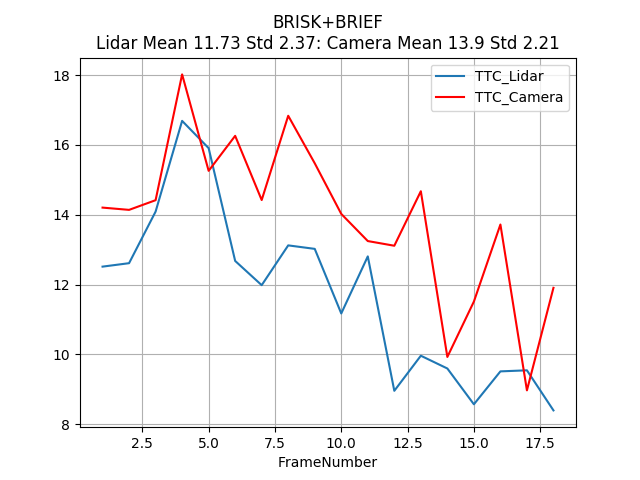
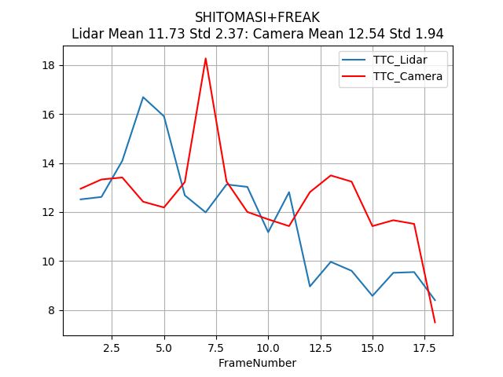

# SFND 3D Object Tracking
## George V. Paul
[Github link to this project is here](https://github.com/gvp-study/SFND_Object_Tracking)


Welcome to the final project of the camera course. By completing all the lessons, you now have a solid understanding of keypoint detectors, descriptors, and methods to match them between successive images. Also, you know how to detect objects in an image using the YOLO deep-learning framework. And finally, you know how to associate regions in a camera image with Lidar points in 3D space. Let's take a look at our program schematic to see what we already have accomplished and what's still missing.


In this final project, you will implement the missing parts in the schematic. To do this, you will complete four major tasks:
1. First, you will develop a way to match 3D objects over time by using keypoint correspondences.
2. Second, you will compute the TTC based on Lidar measurements.
3. You will then proceed to do the same using the camera, which requires to first associate keypoint matches to regions of interest and then to compute the TTC based on those matches.
4. And lastly, you will conduct various tests with the framework. Your goal is to identify the most suitable detector/descriptor combination for TTC estimation and also to search for problems that can lead to faulty measurements by the camera or Lidar sensor. In the last course of this Nanodegree, you will learn about the Kalman filter, which is a great way to combine the two independent TTC measurements into an improved version which is much more reliable than a single sensor alone can be. But before we think about such things, let us focus on your final project in the camera course.

# FP.1: MatchBoundingBoxes
The method "matchBoundingBoxes" takes as input both the previous and the current data frames and provides as output the ids of the matched regions of interest (i.e. the boxID property). The output is a list of pairs of bounding box ids that match between frames. The best match for a bounding box in the previous frame is the bounding box in the current frame with the highest number of keypoint correspondences.

To do this, I iterated over the matched keypoints in list of matches and found the best bounding box correspondences between bounding boxes between frames. I use a 2D array pt_matches to count the match counts between bounding box ids as shown below.

```cpp
void matchBoundingBoxes(std::vector<cv::DMatch> &matches, std::map<int, int> &bbBestMatches, DataFrame &prevFrame, DataFrame &currFrame)
{
    // ...
    int np = prevFrame.boundingBoxes.size();
    int nc = currFrame.boundingBoxes.size();
    cout << "matchBoundingBoxes " << matches.size() << " matches np = "  << np << " nc = " << nc << endl;
    int pt_matches[np][nc];
    for (int i = 0; i < np; i++)
        for (int j = 0; j < nc; j++)
            pt_matches[i][j] = 0;

    for (auto it = matches.begin(); it != matches.end() - 1; ++it)     
    {
        // get current keypoint and its matched partner in the prev. frame
        cv::KeyPoint kpCurr = currFrame.keypoints[it->trainIdx];
        cv::KeyPoint kpPrev = prevFrame.keypoints[it->queryIdx];

	       bool prev_found = false;
        std::vector<int> prev_ids;
        for (int i = 0; i < np; i++)
        {
            if (prevFrame.boundingBoxes[i].roi.contains(cv::Point(kpPrev.pt.x, kpPrev.pt.y)))
            {
                prev_found = true;
                prev_ids.push_back(i);
            }
        }

	       bool curr_found = false;
        std::vector<int> curr_ids;
        for (int i = 0; i < nc; i++)
        {
            if (currFrame.boundingBoxes[i].roi.contains(cv::Point(kpCurr.pt.x, kpCurr.pt.y)))
            {
                curr_found = true;
                curr_ids.push_back(i);
            }
        }

        if (prev_found && curr_found)
        {
            for (auto prev_id: prev_ids)
                for (auto curr_id: curr_ids)
                     pt_matches[prev_id][curr_id] += 1;
        }
    }

    for (int i = 0; i < np; i++)
    {
         int max_count = 0;
         int max_id = 0;
         for (int j = 0; j < nc; j++)
         {
            if (pt_matches[i][j] > max_count)
            {
                max_count = pt_matches[i][j];
                max_id = j;
            }
            bbBestMatches[i] = max_id;
        }
    }
    bool bMsg = true;
    if (bMsg)
        for (int i = 0; i < np; i++)
             cout << "Box " << i << " matches " << bbBestMatches[i]<< " box" << endl;
}
```

# FP.2: ComputeTTCLidar
Compute the time-to-collision in seconds for all matched 3D objects using only Lidar measurements from the matched bounding boxes between current and previous frame.

The original implementation for the midterm project was using the minimum x distance. This base implementation had higher incidences of outliers. So, I switched the implementation from the minimum X distance to the median. This reduced the incidences of outliers considerably.

```cpp

void computeTTCLidar(std::vector<LidarPoint> &lidarPointsPrev,
                     std::vector<LidarPoint> &lidarPointsCurr, double frameRate, double &TTC)
{
     // auxiliary variables
    double dT = 0.1;        // time between two measurements in seconds
    if(frameRate > 0.0)
        dT = 1.0/frameRate;
    double laneWidth = 4.0; // assumed width of the ego lane

    std::sort(lidarPointsPrev.begin(), lidarPointsPrev.end(), [](LidarPoint a, LidarPoint b) {return a.x < b.x; });
    std::sort(lidarPointsCurr.begin(), lidarPointsCurr.end(), [](LidarPoint a, LidarPoint b) {return a.x < b.x; });

    long medPrevIndex = floor(lidarPointsPrev.size() / 2.0);
    long medCurrIndex = floor(lidarPointsCurr.size() / 2.0);
    double medXPrev = lidarPointsPrev[medPrevIndex].x;
    double medXCurr = lidarPointsCurr[medCurrIndex].x;

    // Avoid division by zero.
    if(fabs(medXPrev - medXCurr) > 0.0)
	     TTC = medXCurr * dT / (medXPrev - medXCurr);
    else
	     TTC = NAN;

    cout << "TTC Lidar " << TTC << endl;

}

```

# FP.3: ComputeTTCCamera
Prepare the TTC computation based on camera measurements by associating keypoint correspondences to the bounding boxes which enclose them. All matches which satisfy this condition must be added to a vector in the respective bounding box.

I altered the base implementation in the mid term project to account for all the floating point exceptions that seemed to occur more in the case of the camera. I suspect this is because of the occasional feature matching errors between frames.

```cpp
void computeTTCCamera(std::vector<cv::KeyPoint> &kptsPrev, std::vector<cv::KeyPoint> &kptsCurr,
                      std::vector<cv::DMatch> kptMatches, double frameRate, double &TTC, cv::Mat *visImg)
{
    // compute distance ratios between all matched keypoints
    vector<double> distRatios; // stores the distance ratios for all keypoints between curr. and prev. frame
    for (auto it1 = kptMatches.begin(); it1 != kptMatches.end() - 1; ++it1)
    { // outer kpt. loop

        // get current keypoint and its matched partner in the prev. frame
        cv::KeyPoint kpOuterCurr = kptsCurr.at(it1->trainIdx);
        cv::KeyPoint kpOuterPrev = kptsPrev.at(it1->queryIdx);

        for (auto it2 = kptMatches.begin() + 1; it2 != kptMatches.end(); ++it2)
        { // inner kpt.-loop

            double minDist = 100.0; // min. required distance

            // get next keypoint and its matched partner in the prev. frame
            cv::KeyPoint kpInnerCurr = kptsCurr.at(it2->trainIdx);
            cv::KeyPoint kpInnerPrev = kptsPrev.at(it2->queryIdx);

            // compute distances and distance ratios
            double distCurr = cv::norm(kpOuterCurr.pt - kpInnerCurr.pt);
            double distPrev = cv::norm(kpOuterPrev.pt - kpInnerPrev.pt);

            if (distPrev > std::numeric_limits<double>::epsilon() && distCurr >= minDist)
            { // avoid division by zero

                double distRatio = distCurr / distPrev;
                distRatios.push_back(distRatio);
            }
        } // eof inner loop over all matched kpts
    }     // eof outer loop over all matched kpts

    // only continue if list of distance ratios is not empty
    if (distRatios.size() == 0)
    {
        TTC = NAN;
        return;
    }

    // STUDENT TASK (replacement for meanDistRatio)
    std::sort(distRatios.begin(), distRatios.end());
    long medIndex = floor(distRatios.size() / 2.0);
    // compute median dist. ratio to remove outlier influence
    double medDistRatio = distRatios.size() % 2 == 0 ? (distRatios[medIndex - 1] + distRatios[medIndex]) / 2.0 : distRatios[medIndex];
    // Avoid division by zero.
    if (fabs(medDistRatio - 1.0) < std::numeric_limits<double>::epsilon())
    {
        TTC = NAN;
        return;
    }

    double dT = 0.1;
    if(frameRate > 0.0)
        dT = 1.0 / frameRate;
    TTC = -dT / (1.0 - medDistRatio);
    // EOF STUDENT TASK
    cout << "TTC Camera " << TTC << endl;
}

```

# FP.4: ClusterLidarWithROI
Compute the time-to-collision in seconds for all matched 3D objects using only keypoint correspondences from the matched bounding boxes between current and previous frame.
One part of the code for this task is to set the key point matches in the bounding box in the region of interest.

```cpp
void clusterLidarWithROI(std::vector<BoundingBox> &boundingBoxes, std::vector<LidarPoint> &lidarPoints,
			 float shrinkFactor, cv::Mat &P_rect_xx, cv::Mat &R_rect_xx, cv::Mat &RT)
{
  ...
}
void clusterKptMatchesWithROI(BoundingBox &boundingBox, std::vector<cv::KeyPoint> &kptsPrev,
			      std::vector<cv::KeyPoint> &kptsCurr, std::vector<cv::DMatch> &kptMatches)
{
    // Loop over all matches in the current frame
    for (cv::DMatch match : kptMatches)
    {
        if (boundingBox.roi.contains(kptsCurr[match.trainIdx].pt))
        {
            boundingBox.kptMatches.push_back(match);
        }
    }
}

```
# FP.5: Remove Outliers
Find examples where the TTC estimate of the Lidar sensor does not seem plausible. Describe your observations and provide a sound argumentation why you think this happened.
The primary cause for error in the Lidar TTC estimate is due to the outlier readings due to the nature of the Velodyne sensor. I mitigated this by replacing the minimum distance measured by the median distance. I also added a check to eliminate the division by zero in the TTC computation.

```cpp
// Avoid division by zero.
if (fabs(medDistRatio - 1.0) < std::numeric_limits<double>::epsilon())
   TTC = medXCurr * dT / (medXPrev - medXCurr);
else
   TTC = NAN;
```

# FP.6: Best Detector/Descriptor Combination
Run several detector / descriptor combinations and look at the differences in TTC estimation. Find out which methods perform best and also include several examples where camera-based TTC estimation is way off. As with Lidar, describe your observations again and also look into potential reasons.


There are several ways of showing which methods perform best. You can show some of the following metrics :
- Average TTC in seconds
- Standard Deviation in seconds
- Minimum TTC in seconds


I compared the TTC performance for all combinations of the keypoint detection and descriptor extraction in OpenCV. The results is a table of TTCs for each of the 18 frames and is in this file [performance.csv](./performance.csv).
I computed the mean and standard deviation for all the  detector-descriptor combination by analyzing the performancde.csv file. An example of the results from various combinations is shown below.
## FAST+SIFT

## BRISK+BRIEF

## SHITOMASI+FREAK


Based on this analysis, I would recommend these three combination of detector/descriptors in this order.

| Rank | Detector+Descriptor | Time |
|------|:-------------------:|------|
| 1 | FAST+BRIEF| 10.68 ms |
| 2 | ORB+BRIEF	| 10.69 ms |
| 3 | FAST+ORB	| 11.37 ms |
